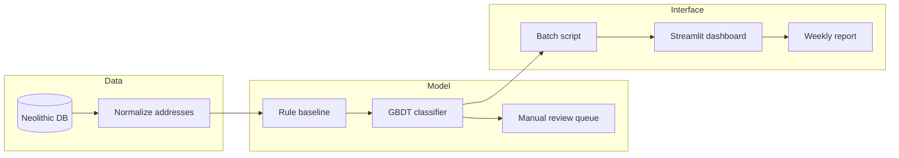

# MFDP_MLOps_ITMO — Матчинг экспозиции и сделок (Neolithic)

Учебный MLOps-проект для рабочего проекта **Neolithic** (Неолитика) — сервис сопоставления объектов недвижимости из **экспозиции** (объявления на продаже) с **сделками** (факт продажи), чтобы отслеживать полный жизненный цикл квартиры или другого объекта недвижимости.

## Контекст предметной области

Проект **Neolithic** собираем для застройщиков данные о том, сколько квартир сейчас в экспозиции (на продаже), с агрегацией по множеству площадок. Параллельно накапливаются данные о **сделках** — объектах, которые ушли с рынка как проданные. Без надёжного матчинга невозможно:

- связать «исчезнувшее объявление» с конкретной сделкой;
- посчитать реальные сроки продаж;
- отличить продажу от снятия объявления без сделки;
- отследить повторное выставление той же квартиры.

**Задача проекта** — реализовать этот матчинг как воспроизводимый ML-сервис с измеримым качеством и полным MLOps-циклом.

---

## 1. Бизнес-анализ (Business Understanding)

Этап посвящён формулировке целей проекта, определению заинтересованных сторон и оценке текущей ситуации. Структура соответствует методологии CRISP-DM и [жизненному циклу ML-модели](https://neerc.ifmo.ru/wiki/index.php?title=Жизненный_цикл_модели_машинного_обучения).

### Организационная структура

| Роль | Описание                                                                                                                            |
|------|-------------------------------------------------------------------------------------------------------------------------------------|
| **Заказчик / владелец продукта** | Проект Neolithic — продукт по сбору и аналитике данных для застройщиков                                                             |
| **Основные пользователи** | Аналитики застройщиков, команда Neolithic, дата-инженеры                                                                 |
| **Конечные потребители результата** | Застройщики, которым нужна актуальная картина рынка: сколько квартир в экспозиции, как быстро уходят в сделки, повторные выставления |

### Коммуникация

- Встречи по проекту Neolithic с преподавателями курса MLOps (ИТМО).
- Документирование решений в репозитории и в общих документах проекта.

### Бизнес-цель

**Построить систему матчинга**, которая связывает записи об объектах недвижимости из экспозиции с соответствующими сделками и позволяет отслеживать **весь путь объекта**:

```
Экспозиция → исчезновение из экспозиции → сделка → (опционально) повторное появление в экспозиции
```

Это даёт застройщикам и аналитикам:

- понимание, какие объявления реально перешли в продажу;
- метрики скорости продаж и оборачиваемости;
- историю объекта при повторных выставлениях на продажу.

### Существующие решения

| Решение | Ограничения |
|---------|-------------|
| Ручной разбор аналитиками | Не масштабируется, высокая стоимость, субъективность |
| Простые правила (точное совпадение адреса/площади) | Данные в экспозиции и в сделке **различаются** (цена, описание, источник, формат полей); много ложных отрицаний |
| Разрозненные выгрузки без единого идентификатора объекта | Невозможно надёжно строить жизненный цикл и агрегированную аналитику |

**Почему нужен новый подход:** требуется автоматизированный матчинг с учётом неполного совпадения признаков, нескольких источников и циклического возврата объектов в экспозицию.

---

## 1.1 Текущая ситуация (оценка ресурсов)

### Железо и инфраструктура

- Используется существующая инфраструктура Neolithic для хранения и обработки данных.
- Для обучения и инференса модели матчинга — вычислительные ресурсы команды.
- MLOps-конвейер: версионирование данных и моделей, CI/CD, мониторинг качества матчинга.

### Данные

**Источники экспозиции** (объекты на продаже):

- сайты застройщиков;
- ДомКлик;
- Циан;
- Этажи;
- другие площадки по мере подключения.

**Данные по сделкам:**

- государственные ресурсы из которых данные попадают во внутреннюю базу команды Neolithic — объекты, которые ранее были в экспозиции, исчезли с площадок и зафиксированы как проданные.

**Особенности данных:**

- между экспозицией и сделкой есть **общие признаки** (ЖК, адрес, площадь, этаж, комнатность, тип объекта и т.д.), но значения могут **отличаться**;
- один физический объект может иметь **несколько записей** в экспозиции (разные площадки, переобъявления);
- после сделки объект может **снова попасть в экспозицию** — нужна поддержка повторных циклов.

Доступ к данным предоставляется из базы данных Neolithic. Дополнительные внешние данные на первом этапе не требуются.

### Эксперты

- Предметные эксперты Neolithic по рынку новостроек и структуре источников.
- Аналитики для разметки эталонных пар «экспозиция — сделка» и валидации качества матчинга.

### Управление рисками

| Риск | Вероятность / влияние | Митигация |
|------|------------------------|-----------|
| Не уложиться в сроки курса / релиза | Средняя | Поэтапный план, MVP на правилах + ML, приоритизация одного типа объектов (квартиры) |
| Мало или плохое качество размеченных данных для обучения | Высокая | Ручная разметка пилотной выборки, активное обучение, гибрид правил и модели |
| В данных нет устойчивых закономерностей для автоматического матчинга | Средняя | Блокирующие ключи (ЖК + корпус + площадь), fuzzy-matching по адресу, эскалация на ручную проверку |
| Высокий Precision, но низкий Recall (пропуск сделок) | Высокая | Настройка порогов, каскад: строгий матч → мягкий матч → «кандидат» |
| Высокий Recall, но низкий Precision (ложные связки) | Высокая | Двухэтапная верификация, метрики на размеченной выборке, мониторинг в проде |
| Дрейф данных (новые форматы источников) | Средняя | Мониторинг распределений признаков, переобучение по расписанию |

---

## 1.2 Решаемые задачи с точки зрения аналитики (Data Mining goals)

### Постановка задачи в терминах ML

**Entity resolution / record linkage** — для каждой записи экспозиции (или кластера записей одного объявления) определить:

1. соответствует ли она конкретной сделке;
2. является ли это тем же физическим объектом при повторном появлении в экспозиции.

Формулировки:

- **Бинарная классификация пар** (exposition_record, deal_record) → match / no match.
- **Ранжирование кандидатов** — для каждой экспозиции топ-N сделок с оценкой схожести.
- **Кластеризация / идентификация сущности** — единый `property_id` на весь жизненный цикл объекта.

### Ключевые признаки для матчинга (предварительно)

- идентификаторы и нормализованный адрес (дом, корпус, квартира);
- жилой комплекс, застройщик;
- площадь, этаж, число комнат;
- тип объекта;
- временные окна (дата появления/исчезновения из экспозиции, дата сделки);
- цена (как вспомогательный, не единственный признак).

### Метрики оценки модели

| Метрика | Назначение |
|---------|------------|
| **Precision** | Доля верных связок среди всех предсказанных матчей — критично, чтобы не искажать аналитику застройщика |
| **Recall** | Доля найденных реальных пар — важно не терять сделки |
| **F1-score** | Сводный баланс Precision и Recall |
| **AUC-ROC / PR-AUC** | При вероятностной постановке и дисбалансе классов |
| **Accuracy@k** | Попадание правильной сделки в топ-k кандидатов |

### Критерии успешности (SMART, уточняются на пилоте)

| Уровень | Precision | Recall | Комментарий |
|---------|-----------|--------|-------------|
| Минимально допустимый | ≥ 0.85 | ≥ 0.70 | Допустимо для MVP с ручной доразметкой спорных случаев |
| Целевой | ≥ 0.92 | ≥ 0.80 | Для промышленного использования застройщиками |
| Оптимальный | ≥ 0.95 | ≥ 0.85 | При достаточном объёме качественной разметки |

Дополнительно на уровне бизнеса: доля объектов с восстановленным полным жизненным циклом (экспозиция → сделка) не ниже согласованного порога на пилотном ЖК.

### Альтернативная оценка (без чисто объективных метрик)

- экспертная выборочная проверка аналитиками Neolithic (например, 200 случайных матчей);
- согласование с известными кейсами «золотого стандарта»;
- A/B: новая модель vs текущие правила на историческом периоде.

---

## 1.3 План проекта

План охватывает [шесть этапов жизненного цикла ML-модели](https://neerc.ifmo.ru/wiki/index.php?title=Жизненный_цикл_модели_машинного_обучения). Ниже — что будет сделано в рамках проекта по каждому этапу.

### Этап 1. Бизнес-анализ 

- Зафиксированы цель, пользователи, риски, метрики и критерии успеха.
- Согласована постановка задачи матчинга экспозиции и сделок.

### Этап 2. Анализ и подготовка данных

| Подэтап | Действия в проекте                                                                                |
|---------|---------------------------------------------------------------------------------------------------|
| Анализ данных | Инвентаризация таблиц экспозиции и сделок; профилирование пропусков, дубликатов, форматов адресов |
| Сбор данных | Подключение выгрузок из Циан, ДомКлик, Этажи, сайтов застройщиков и внутренней БД сделок          |
| Нормализация | Единая схема полей, нормализация адресов и площадей, дедупликация объявлений внутри экспозиции    |
| Моделирование данных | Сущности: `listing`, `deal`, `property`, `match`, события жизненного цикла                        |
| Конструирование признаков | Признаки схожести пар, временные лаги, источник, текстовая близость описаний                      |

### Этап 3. Моделирование

| Подэтап | Действия в проекте |
|---------|-------------------|
| Выбор алгоритма | Базлайн: правила + fuzzy matching; ML: градиентный бустинг / классификатор пар; опционально embeddings для текстов |
| Планирование тестирования | Train / val / test с временным сплитом; кросс-валидация по ЖК; разметка hold-out набора |
| Обучение | Итерации подбора признаков и гиперпараметров, логирование экспериментов (MLflow и др.) |
| Оценка результатов | Precision, Recall, F1, PR-кривые; анализ ошибок; сравнение с rule-based baseline |

### Этап 4. Оценка решения

- Сопоставление качества модели с бизнес-целями Neolithic и застройщиков.
- Разбор сильных и слабых сторон пилота, спорных кейсов (повторная экспозиция, переуступки).
- Решение: внедрять текущую версию или доработать данные/модель.

### Этап 5. Внедрение

- Сервис матчинга (batch и/или API) в контуре Neolithic.
- Конвейер: загрузка свежей экспозиции и сделок → инференс → обновление графа жизненного цикла объектов.
- Интеграция с дашбордами и отчётами для застройщиков.
- CI/CD, контейнеризация, версионирование моделей.

### Этап 6. Тестирование и мониторинг

| Тип | Действия |
|-----|----------|
| Дифференциальные тесты | Сравнение новой версии модели со стабильной на фиксированном тестовом срезе |
| Контрольные тесты | Время инференса и обучения, регрессии по SLA |
| Нагрузочные тесты | Пиковые объёмы объявлений по крупным ЖК |
| Мониторинг в проде | Доля матчей, распределение скоров, дрейф признаков, алерты при падении Precision/Recall на shadow-разметке |

---

## Ссылки

- [Жизненный цикл модели машинного обучения — Викиконспекты ИТМО](https://neerc.ifmo.ru/wiki/index.php?title=Жизненный_цикл_модели_машинного_обучения)
- [Процесс разработки сервисов машинного обучения (Google Docs)](https://docs.google.com/document/d/1mlRpHvBO-X186QLbUtB4_YgxjuT5x4u4fg6JBUJnL4I/edit?tab=t.0)

---

## Команда

Проект выполняется в рамках курса **MLOps** ИТМО членом команды **Neolithic**.

---

## 2. Создаём прототип продукта

Раздел описывает прототип ML-сервиса Neolithic для матчинга экспозиции и сделок. 

### 1. Ключевая гипотеза

| Параметр | Значение |
|----------|----------|
| **Продукт A** | Модуль автоматического матчинга «экспозиция → сделка» в составе аналитической платформы Neolithic |
| **Сегмент B** | Аналитики девелопера среднего размера (1–3 ЖК в пилоте), которые сейчас вручную связывают исчезнувшие объявления со сделками |
| **Сценарий C** | Еженедельный batch-отчёт по одному пилотному ЖК: сколько квартир ушло из экспозиции и сколько из них подтверждено как сделки |
| **Способ монетизации** | B2B-подписка — дополнительный модуль к существующему договору Neolithic с застройщиком; проверяем готовность платить за сокращение ручного труда |

**Формулировка гипотезы:**

> Если мы предлагаем **автоматический матчинг экспозиции и сделок по одному ЖК** для **аналитиков застройщика среднего размера** в сценарии **еженедельного отчёта по жизненному циклу квартир**, то мы получим **долю объектов с корректно восстановленным циклом «экспозиция → сделка» (Coverage)** не меньше **75%** в течение **6 недель пилота**, потому что **общие признаки (ЖК, адрес, площадь, этаж) достаточны для rule-based + ML baseline при ручной валидации спорных случаев**.

**Обоснование:** в данных Neolithic есть общие признаки между экспозицией и сделкой, но значения полей расходятся; текущий ручной разбор не масштабируется на весь объём объявлений с площадок (Циан, ДомКлик, Этажи и др.).

### 2. Ключевые метрики

На этапе прототипа **не измеряем** MAU, 6-месячный retention и ROI — они не показательны.

#### Продуктовые и бизнес-метрики

| Метрика | Целевое значение | Способ измерения | Baseline | Частота |
|---------|------------------|------------------|----------|---------|
| **Coverage** — доля квартир пилотного ЖК с полным циклом «экспозиция → сделка» | ≥ 75% | Экспертная разметка выборки из 200 объектов пилотного ЖК | ~40–50% при ручном разборе той же выборки без автоматизации | Еженедельно |
| **Time-to-insight** — время подготовки отчёта аналитиком | ≤ 2 ч | Замер по чек-листу этапов отчёта (выгрузка → проверка → финальный документ) | 8–12 ч на тот же объём данных | Каждый отчёт |

#### Технические метрики

| Метрика | Целевое значение | Способ измерения                                             | Baseline | Частота |
|---------|------------------|--------------------------------------------------------------|----------|---------|
| **Precision@match** | ≥ 0.85 | Confusion matrix на размеченной hold-out выборке (≥ 500 пар) | ~0.70 у rule-only baseline (точное совпадение адреса + площади) | После каждого переобучения |
| **Recall@match** | ≥ 0.70 | Тот же hold-out набор                                        | ~0.55 у rule-only baseline | После каждого переобучения |
| **Accuracy@3** — правильная сделка в топ-3 кандидатов | ≥ 0.90 | Ранжирование кандидатов на тестовой выборке                  | N/A (ранжирование не реализовано в rule-only) | Еженедельно |
| **Себестоимость batch-прогона** | ≤ 500 ₽ / ЖК / неделя | Логи с серверов компании                                     | ~15 000 ₽ / неделя — стоимость ручного труда аналитика на тот же объём | Еженедельно |
| **Стабильность пайплайна** — успешный end-to-end прогон без ручного вмешательства | ≥ 95% | Логи скрипта / CI-запуска                                    | N/A (пайплайн ещё не собран) | Ежедневно |

### 3. Scope прототипа

#### Входит в прототип

- Один тип объектов — **квартиры**; один пилотный **ЖК**
- Источники данных: внутренняя БД Neolithic (экспозиция + сделки), без подключения новых краулеров
- Нормализация адресов, блокирующие ключи (ЖК + корпус + площадь)
- Baseline: правила + fuzzy matching; ML: градиентный бустинг на размеченных парах
- Batch-пайплайн (Python-скрипт / notebook) + простой **Streamlit-дашборд** или CSV-отчёт
- Ручная доразметка спорных матчей (очередь «кандидатов»)
- Логирование экспериментов (MLflow local)

#### Намеренно не делаем (и почему)

| Исключено | Причина |
|-----------|---------|
| Мульти-ЖК / все города | Не нужно для проверки гипотезы на одном сегменте |
| Real-time API и интеграция с прод-дашбордами Neolithic | Дорого; batch достаточен для сценария еженедельного отчёта |
| Повторные циклы «сделка → снова в экспозицию» | Усложняет scope без влияния на ключевую гипотезу; откладываем на v2 |
| Полный MLOps (CI/CD, drift-мониторинг, A/B в проде) | После валидации ценности прототипа |
| Embeddings / LLM для текстов описаний | Overengineering до подтверждения baseline |
| 100% unit-тестов и полная документация | Не помогают принять решение о продукте на этапе прототипа |

### 4. Готовые блоки и инструменты vs собственная разработка

#### Готовые блоки (переиспользуем)

| Инструмент / блок | Назначение |
|-------------------|------------|
| PostgreSQL / существующая БД Neolithic | Источник данных экспозиции и сделок |
| pandas, scikit-learn / CatBoost | Baseline и ML-модель без собственного фреймворка |
| rapidfuzz / recordlinkage | Fuzzy-matching адресов |
| MLflow | Трекинг экспериментов и версий модели |
| Streamlit | Быстрый UI для аналитика |
| Google Colab / Yandex Cloud VM | Обучение и batch-прогон без собственного кластера |

#### Делаем сами (критично для проверки гипотезы)

| Компонент | Почему критично |
|-----------|-----------------|
| Схема сущностей `listing` / `deal` / `match` | Специфика Neolithic; готового решения нет |
| Feature engineering для пар «экспозиция — сделка» | Ядро ценности продукта |
| Правила блокировки и пороги матчинга | Доменная логика рынка новостроек |
| Пайплайн разметки и очередь «кандидатов» | Контроль Precision в пилоте |
| Шаблон еженедельного отчёта для застройщика | Проверяемый сценарий C из гипотезы |

### 5. Главный риск, который проверяет прототип

**Риск:** при расхождении полей между экспозицией и сделкой автоматический матчинг **не даст достаточного Recall без массовой ручной доразметки** — продукт не окупит экономику для застройщика.

Прототип проверяет именно этот риск, а не вопрос «можно ли обучить любую модель» (технически это тривиально). Если Recall останется ниже 0.65 при Precision ≥ 0.85 даже после итераций разметки, гипотеза не подтверждается.

### 6. Формат и вид прототипа

| Компонент | Формат |
|-----------|--------|
| Пайплайн | Jupyter notebook + Python-скрипт batch-матчинга |
| Интерфейс | Streamlit-дашборд: таблица матчей, фильтр по ЖК, очередь спорных пар для эксперта |
| Выход | CSV/Parquet + краткий markdown-отчёт для аналитика застройщика |
| Демо | Прогон на исторических данных пилотного ЖК за 3 месяца |



### 7. Критерии остановки теста прототипа

#### Остановка с успехом (persevere)

- Coverage ≥ 75% **и** Precision ≥ 0.85 на hold-out **и** ≥ 2 из 3 аналитиков подтверждают ценность отчёта
- → переход к интеграции модуля в контур Neolithic

#### Остановка с провалом (pivot / stop)

- После 6 недель: Coverage < 60% **или** Precision < 0.75 при Recall < 0.65
- → гипотеза не подтверждена; pivot: усилить разметку / сузить до одного источника / отказ от полной автоматизации

#### Досрочная остановка

- Невозможно собрать ≥ 300 размеченных пар за 3 недели → стоп, меняем план по данным
- Себестоимость прогона > 3× целевой (1 500 ₽ / ЖК / неделя) без роста метрик → стоп, упрощаем пайплайн

### Использованные подходы

- [BABOK — Prototyping](https://www.iiba.org/knowledgehub/business-analysis-body-of-knowledge-babok-guide/10-techniques/10-36-prototyping/) — throw-away и evolutionary прототипы
- [Lean Startup — Build-Measure-Learn](https://theleanstartup.com/principles) — фальсифицируемая гипотеза и пороги валидации
- [CRISP-ML(Q)](https://arxiv.org/pdf/2003.05155) — QA и риски на этапах ML-проекта
