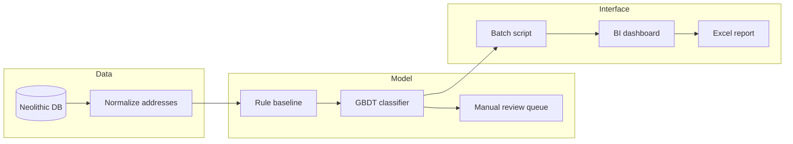

# MFDP_MLOps_ITMO — Матчинг экспозиции и сделок (Neolithic)

Учебный MLOps-проект для рабочего проекта **Neolithic** (Неолитика) — сервис сопоставления объектов недвижимости из **экспозиции** (объявления на продаже) с **сделками** (факт продажи), чтобы отслеживать полный жизненный цикл квартиры или другого объекта недвижимости.

## Контекст предметной области
  
Проект **Neolithic** собираем для застройщиков данные о том, сколько квартир сейчас в экспозиции (на продаже), 
с агрегацией по множеству площадок. Параллельно накапливаются данные о **сделках** — объектах, которые ушли с рынка как проданные. 
  
### Сделки бывают:  
**ДДУ - договор долевого участия** когда продажа от застройщика недвижимости на этапе строительства (в просторечье "на этапе котлована"):
1) От юрлица;
2) от физлица за наличный расчёт;
3) от физлица по ипотечным программам и другим льготным (дальневосточная, арктическая и тд);
4) и тд

**ДКП - договор купли-продажи**:
1) когда продажа от застройщика недвижимости введенной в эксплуатацию (новое жильё, ещё никто не жил) (продажа от юрлица);
2) продажа от физлица купившего строющуюся недвижимости (по ДДУ) не введенную в эксплуатацию - называется "уступка";
3) продажа от физлица купившего строющуюся недвижимости (по ДДУ) введенную в эксплуатацию;
4) и тд

### Экспозиция бывает:  
1) От застройщика - первичка;
2) От физлица - вторичка не введенное в эксплуатацию (но нового жилья от застройщика в котором никто не жил смотри выше ДДУ и "уступка")  
3) От физлица - вторичка не введенное в эксплуатацию с действующей ипотекой
4) От физлица - вторичка введенное в эксплуатацию
5) и тд

И разнообразных примеров ещё много. Они на разных источниках информации могут называться по разному, иметь разное заполнени, поля, содержание данных, данные могут быть неполные
Например на вторичном рынке в объявлениях (в основном от риелторов) никто не будет указывать номер квартиры, так как покупатель просто выйдет на собственника напрямую минуя риелтора.
Но наша цель сматчить квартиры с экспозиции (с продажи) с квартирой которая в сделке, что эта квартира продалась, а не просто собственник передумал и снял объявление о продаже

Без надёжного матчинга невозможно:

- связать «исчезнувшее объявление» с конкретной сделкой;
- посчитать реальные сроки продаж;
- отличить продажу от снятия объявления без сделки;
- отследить повторное выставление той же квартиры.

**Задача проекта** — реализовать этот матчинг как воспроизводимый ML-сервис с измеримым качеством и полным MLOps-циклом.

---

## 1. Бизнес-анализ (Business Understanding)

Этап посвящён формулировке целей проекта, определению заинтересованных сторон и оценке текущей ситуации. Структура соответствует методологии CRISP-DM и [жизненному циклу ML-модели](https://neerc.ifmo.ru/wiki/index.php?title=Жизненный_цикл_модели_машинного_обучения).

### Организационная структура  
  
Таблица 1-1  

| Роль | Описание                                                                                                                            |
|------|-------------------------------------------------------------------------------------------------------------------------------------|
| **Заказчик / владелец продукта** | Проект Neolithic — продукт по сбору и аналитике данных для застройщиков                                                             |
| **Основные пользователи** | Аналитики застройщиков, команда Neolithic, дата-инженеры                                                                 |
| **Конечные потребители результата** | Застройщики, которым нужна актуальная картина рынка: сколько квартир в экспозиции, как быстро уходят в сделки, повторные выставления |

### Коммуникация

- Встречи по проекту Neolithic с преподавателями курса MLOps (ИТМО).
- Документирование решений в репозитории и в общих документах проекта.

### Бизнес-цель

**Построить систему матчинга**, которая связывает записи об объектах недвижимости из экспозиции с соответствующими сделками и позволяет отслеживать **весь путь объекта**:

```
Экспозиция → исчезновение из экспозиции → сделка → (опционально) повторное появление в экспозиции
```

Это даёт застройщикам и аналитикам:

- понимание, какие объявления реально перешли в продажу;
- метрики скорости продаж и оборачиваемости;
- историю объекта при повторных выставлениях на продажу.

### Существующие решения  

Таблица 1-2  

| Решение                                                     | Ограничения                                                                                                                                                        |
|-------------------------------------------------------------|--------------------------------------------------------------------------------------------------------------------------------------------------------------------|
| Ручной разбор аналитиками                                   | Не масштабируется, высокая стоимость, не полные данные сложно сопоставить                                                                                          |
| Простые правила (точное совпадение адреса/площади и другие) | Данные и по полям и по содержанию в экспозиции и в сделке **различаются** (цена, описание, источник, формат полей); много ложно отрицательных (пример Таблица 1-3) |
| Разрозненные выгрузки без единого идентификатора объекта    | Невозможно надёжно строить жизненный цикл и агрегированную аналитику                                                                                               |


Таблица 1-3 Пример расхождения данных между источниками — одна и та же квартира, но простые правила её **не сматчат** (ложное отрицание):  

| Экспозиция (Циан/Домклик/другие) | Сделка (Госисточники / внутр. БД) |
|----------------------------------|-----------------------------------|
| «ул. Мельникайте, 114, кв. 45»   | «Мельникайте ул., д. 114          |
| Площадь **42.3** м²              | Площадь **42.5** м²               |
| ЖК «Сибирский»                   | ЖК «ЖК Сибирский»                 |
| Номер договора М114              | Номер договора 114-45             |

**Почему нужен новый подход:** требуется автоматизированный матчинг с учётом неполного совпадения признаков, нескольких источников и циклического возврата объектов в экспозицию.

---

## 1.1 Текущая ситуация (оценка ресурсов)

### Железо и инфраструктура

- Используется существующая инфраструктура Neolithic для хранения и обработки данных.
- Для обучения и инференса модели матчинга — вычислительные ресурсы команды.
- MLOps-конвейер: версионирование данных и моделей, CI/CD, мониторинг качества матчинга.

### Данные

**Источники экспозиции** (объекты на продаже):

- сайты застройщиков;
- ДомКлик;
- Циан;
- Этажи;
- другие площадки по мере подключения.

**Данные по сделкам:**

- государственные ресурсы из которых данные попадают во внутреннюю базу команды Neolithic — объекты, которые ранее были в экспозиции, исчезли с площадок и зафиксированы как проданные.

**Особенности данных:**

- между экспозицией и сделкой есть **общие признаки** (ЖК, адрес, площадь, этаж, комнатность, тип объекта и т.д.), но значения могут **отличаться**;
- один физический объект может иметь **несколько записей** в экспозиции (разные площадки, переобъявления);
- после сделки объект может **снова попасть в экспозицию** — нужна поддержка повторных циклов.

Доступ к данным предоставляется из базы данных Neolithic. Дополнительные внешние данные на первом этапе не требуются. **Пилот:** регион **Тюмень**, исторические данные **с 2024 г.**

### Эксперты

- Предметные эксперты Neolithic по рынку новостроек и структуре источников.
- Аналитики для разметки эталонных пар «экспозиция — сделка» и валидации качества матчинга.

### Управление рисками
  
Таблица 1.1-1  

| Риск | Вероятность / влияние | Митигация |
|------|------------------------|-----------|
| Не уложиться в сроки курса / релиза | Средняя | Поэтапный план, MVP на правилах + ML, приоритизация одного типа объектов (квартиры) и пилотного региона (Тюмень) |
| Мало или плохое качество размеченных данных для обучения | Высокая | Ручная разметка пилотной выборки, активное обучение, гибрид правил и модели |
| В данных нет устойчивых закономерностей для автоматического матчинга | Средняя | Блокирующие ключи (ЖК + корпус + площадь), fuzzy-matching по адресу, эскалация на ручную проверку |
| Высокий Precision, но низкий Recall (пропуск сделок) | Высокая | Настройка порогов, каскад: строгий матч → мягкий матч → «кандидат» |
| Высокий Recall, но низкий Precision (ложные связки) | Высокая | Двухэтапная верификация, метрики на размеченной выборке, мониторинг в проде |
| Дрейф данных (новые форматы источников) | Средняя | Мониторинг распределений признаков, переобучение по расписанию |

---

## 1.2 Решаемые задачи с точки зрения аналитики (Data Mining goals)

### Постановка задачи в терминах ML

**Entity resolution / record linkage** — для каждой записи экспозиции (или кластера записей одного объявления) определить:

1. соответствует ли она конкретной сделке;
2. является ли это тем же физическим объектом при повторном появлении в экспозиции.

Формулировки:

- **Бинарная классификация пар** (exposition_record, deal_record) → match / no match.
- **Ранжирование кандидатов** — для каждой экспозиции топ-N сделок с оценкой схожести.
- **Кластеризация / идентификация сущности** — единый `property_id` на весь жизненный цикл объекта.

### Ключевые признаки для матчинга (предварительно)

- идентификаторы и нормализованный адрес (дом, корпус, квартира);
- жилой комплекс, застройщик;
- площадь, этаж, число комнат;
- тип объекта;
- временные окна (дата появления/исчезновения из экспозиции, дата сделки);
- цена (как вспомогательный, не единственный признак).

### Метрики оценки модели
  
Таблица 1.2-1 

| Метрика | Назначение |
|---------|------------|
| **Precision** | Доля верных связок среди всех предсказанных матчей — критично, чтобы не искажать аналитику застройщика |
| **Recall** | Доля найденных реальных пар — важно не терять сделки |
| **F1-score** | Сводный баланс Precision и Recall |
| **AUC-ROC / PR-AUC** | При вероятностной постановке и дисбалансе классов |
| **Accuracy@k** | Попадание правильной сделки в топ-k кандидатов |

### Критерии успешности (SMART, уточняются на пилоте)

Таблица 1.2-2

| Уровень | Precision | Recall | Комментарий |
|---------|-----------|--------|-------------|
| Минимально допустимый | ≥ 0.85 | ≥ 0.70 | Допустимо для MVP с ручной доразметкой спорных случаев |
| Целевой | ≥ 0.92 | ≥ 0.80 | Для промышленного использования застройщиками |
| Оптимальный | ≥ 0.95 | ≥ 0.85 | При достаточном объёме качественной разметки |

Дополнительно на уровне бизнеса: **Coverage ≥ 75%** — доля объектов с восстановленным полным жизненным циклом (экспозиция → сделка) на пилотном регионе (**Тюмень**, данные **с 2024 г.**).

### Альтернативная оценка (без чисто объективных метрик)

- экспертная выборочная проверка аналитиками Neolithic (например, 500 случайных матчей);
- согласование с известными кейсами «золотого стандарта»;
- A/B: новая модель vs текущие правила на историческом периоде.

---

## 1.3 План проекта

План охватывает [шесть этапов жизненного цикла ML-модели](https://neerc.ifmo.ru/wiki/index.php?title=Жизненный_цикл_модели_машинного_обучения). Ниже — что будет сделано в рамках проекта по каждому этапу.

### Этап 1. Бизнес-анализ 

- Зафиксированы цель, пользователи, риски, метрики и критерии успеха.
- Согласована постановка задачи матчинга экспозиции и сделок.

### Этап 2. Анализ и подготовка данных
  
Таблица 1.3-1  

| Подэтап | Действия в проекте                                                                                |
|---------|---------------------------------------------------------------------------------------------------|
| Анализ данных | Инвентаризация таблиц экспозиции и сделок; профилирование пропусков, дубликатов, форматов адресов |
| Сбор данных | Подключение выгрузок из Циан, ДомКлик, Этажи, сайтов застройщиков и внутренней БД сделок          |
| Нормализация | Единая схема полей, нормализация адресов и площадей, дедупликация объявлений внутри экспозиции    |
| Моделирование данных | Сущности: `listing`, `deal`, `property`, `match`, события жизненного цикла                        |
| Конструирование признаков | Признаки схожести пар, временные лаги, источник, текстовая близость описаний                      |

### Этап 3. Моделирование
  
Таблица 1.3-2  
  
| Подэтап | Действия в проекте |
|---------|-------------------|
| Выбор алгоритма | Базлайн: правила + fuzzy matching; ML: градиентный бустинг / классификатор пар; опционально embeddings для текстов |
| Планирование тестирования | Train / val / test с временным сплитом; кросс-валидация по ЖК внутри пилотного региона (Тюмень); разметка hold-out набора |
| Обучение | Итерации подбора признаков и гиперпараметров, логирование экспериментов (MLflow и др.) |
| Оценка результатов | Precision, Recall, F1, PR-кривые; анализ ошибок; сравнение с rule-based baseline |

### Этап 4. Оценка решения

- Сопоставление качества модели с бизнес-целями Neolithic и застройщиков.
- Разбор сильных и слабых сторон пилота, спорных кейсов (повторная экспозиция, переуступки).
- Решение: внедрять текущую версию или доработать данные/модель.

### Этап 5. Внедрение

- Сервис матчинга (batch + **Excel-отчёт / API / BI-дашборд**) в контуре Neolithic.
- Конвейер: загрузка свежей экспозиции и сделок → инференс → обновление графа жизненного цикла объектов.
- Поставка результата застройщикам через **Excel-отчёт / API / BI-дашборд**.
- CI/CD, контейнеризация, версионирование моделей.

### Этап 6. Тестирование и мониторинг

Таблица 1.3-3  

| Тип | Действия |
|-----|----------|
| Дифференциальные тесты | Сравнение новой версии модели со стабильной на фиксированном тестовом срезе |
| Контрольные тесты | Время инференса и обучения, регрессии по SLA |
| Нагрузочные тесты | Пиковые объёмы объявлений по крупным ЖК |
| Мониторинг в проде | Доля матчей, распределение скоров, дрейф признаков, алерты при падении Precision/Recall на shadow-разметке |

---

## Ссылки

- [Жизненный цикл модели машинного обучения — Викиконспекты ИТМО](https://neerc.ifmo.ru/wiki/index.php?title=Жизненный_цикл_модели_машинного_обучения)
- [Процесс разработки сервисов машинного обучения (Google Docs)](https://docs.google.com/document/d/1mlRpHvBO-X186QLbUtB4_YgxjuT5x4u4fg6JBUJnL4I/edit?tab=t.0)

---

## Команда

Проект выполняется в рамках курса **MLOps** ИТМО членом команды **Neolithic**.

---

## 2. Создаём прототип продукта

Раздел описывает прототип ML-сервиса Neolithic для матчинга экспозиции и сделок. 

### 2.1. Ключевая гипотеза

Таблица 2.1-1

| Параметр | Значение |
|----------|----------|
| **Продукт A** | Модуль автоматического матчинга «экспозиция → сделка» в составе аналитической платформы Neolithic |
| **Сегмент B** | Аналитики застройщиков **любого размера**, а также команда Neolithic, которые сейчас вручную или алгоритмически связывают исчезнувшие объявления со сделками |
| **Сценарий C** | Ежемесячная поставка результата по пилотному региону (**Тюмень**): **Excel-отчёт / API / BI-дашборд** — сколько квартир ушло из экспозиции и сколько из них подтверждено как сделки |
| **Способ монетизации** | B2B-подписка — платформа Neolithic с модулем матчинга (**≤ 40 тыс. ₽/мес**); модуль сокращает ручной труд команды Neolithic при сведении экспозиции и сделок |

**Формулировка гипотезы:**

> Если мы предлагаем **автоматический матчинг экспозиции и сделок в пилотном регионе (Тюмень)** для **аналитиков застройщиков любого размера** в сценарии **ежемесячной поставки результата (Excel-отчёт / API / BI-дашборд) по жизненному циклу квартир**, то мы получим **долю объектов с корректно восстановленным циклом «экспозиция → сделка» (Coverage)** не меньше **75%** в течение **6 недель пилота**, потому что **общие признаки (ЖК, адрес, площадь, этаж) достаточны для rule-based + ML baseline при ручной валидации спорных случаев**.

**Обоснование:** в данных Neolithic есть общие признаки между экспозицией и сделкой, но значения полей расходятся; текущий ручной разбор не масштабируется на весь объём объявлений с площадок (Циан, ДомКлик, Этажи и др.).

### 2.2. Ключевые метрики

На этапе прототипа **не измеряем** MAU, 6-месячный retention и ROI — они не показательны.

#### Продуктовые и бизнес-метрики  

Таблица 2.2-1

| Метрика | Целевое значение | Способ измерения | Baseline | Частота |
|---------|------------------|------------------|----------|---------|
| **Coverage** — доля квартир пилотного региона (Тюмень) с полным циклом «экспозиция → сделка» | ≥ 75% | Экспертная разметка выборки из 500 объектов по Тюмени | ~40–50% при ручном разборе той же выборки без автоматизации | Ежемесячно |

#### Технические метрики  

Таблица 2.2-2

| Метрика | Целевое значение | Способ измерения                                             | Baseline | Частота |
|---------|------------------|--------------------------------------------------------------|----------|---------|
| **Precision@match** | ≥ 0.85 | Confusion matrix на размеченной hold-out выборке (≥ 500 пар) | ~0.70 у rule-only baseline (точное совпадение адреса + площади) | После каждого переобучения |
| **Recall@match** | ≥ 0.70 | Тот же hold-out набор                                        | ~0.55 у rule-only baseline | После каждого переобучения |
| **Accuracy@3** — правильная сделка в топ-3 кандидатов | ≥ 0.90 | Ранжирование кандидатов на тестовой выборке                  | N/A (ранжирование не реализовано в rule-only) | Ежемесячно |
| **Себестоимость batch-прогона** | ≤ 500 ₽ / ЖК / неделя | Логи с серверов компании                                     | ~15 000 ₽ / неделя — стоимость ручного труда аналитика на тот же объём | Еженедельно |
| **Стабильность пайплайна** — успешный end-to-end прогон без ручного вмешательства | ≥ 95% | Логи скрипта / CI-запуска                                    | N/A (пайплайн ещё не собран) | Ежедневно |

### 2.3. Scope прототипа

#### Входит в прототип

- Один тип объектов — **квартиры**; один пилотный **регион (Тюмень)**, данные **с 2024 г.**
- Источники данных: внутренняя БД Neolithic (экспозиция + сделки), без подключения новых краулеров
- Нормализация адресов, блокирующие ключи (ЖК + корпус + площадь)
- Baseline: правила + fuzzy matching; ML: градиентный бустинг на размеченных парах
- Batch-пайплайн (Python-скрипт / notebook) + **Excel-отчёт / API / BI-дашборд**
- Ручная доразметка спорных матчей (очередь «кандидатов»)
- Логирование экспериментов (MLflow local)

#### Намеренно не делаем (и почему)  

Таблица 2.3-1

| Исключено | Причина |
|-----------|---------|
| Мульти-регион / все города | Не нужно для проверки гипотезы на одном пилотном регионе (Тюмень) |
| Real-time API и интеграция с прод-дашбордами Neolithic | Дорого; batch + Excel-отчёт / API / BI-дашборд достаточны для сценария ежемесячной поставки результата |
| Повторные циклы «сделка → снова в экспозицию» | Усложняет scope без влияния на ключевую гипотезу; откладываем на v2 |
| Полный MLOps (CI/CD, drift-мониторинг, A/B в проде) | После валидации ценности прототипа |
| Embeddings / LLM для текстов описаний | Overengineering до подтверждения baseline |
| 100% unit-тестов и полная документация | Не помогают принять решение о продукте на этапе прототипа |

### 2.4. Готовые блоки и инструменты vs собственная разработка

#### Готовые блоки (переиспользуем)

Таблица 2.4-1

| Инструмент / блок | Назначение |
|-------------------|------------|
| PostgreSQL / существующая БД Neolithic | Источник данных экспозиции и сделок |
| pandas, scikit-learn / CatBoost | Baseline и ML-модель без собственного фреймворка |
| rapidfuzz / recordlinkage | Fuzzy-matching адресов |
| MLflow | Трекинг экспериментов и версий модели |
| BI-дашборд (контур Neolithic) | Визуализация матчей и очереди кандидатов для аналитика |
| Google Colab / Yandex Cloud VM | Обучение и batch-прогон без собственного кластера |

#### Делаем сами (критично для проверки гипотезы)

Таблица 2.4-2

| Компонент | Почему критично |
|-----------|-----------------|
| Схема сущностей `listing` / `deal` / `match` | Специфика Neolithic; готового решения нет |
| Feature engineering для пар «экспозиция — сделка» | Ядро ценности продукта |
| Правила блокировки и пороги матчинга | Доменная логика рынка новостроек |
| Пайплайн разметки и очередь «кандидатов» | Контроль Precision в пилоте |
| Шаблон ежемесячного Excel-отчёта для застройщика | Проверяемый сценарий C из гипотезы |

### 2.5. Главный риск, который проверяет прототип

**Риск:** при расхождении полей между экспозицией и сделкой автоматический матчинг **не даст достаточного Recall без массовой ручной доразметки** — продукт не окупит экономику для застройщика.

Прототип проверяет именно этот риск, а не вопрос «можно ли обучить любую модель» (технически это тривиально). Если Recall останется ниже 0.65 при Precision ≥ 0.85 даже после итераций разметки, гипотеза не подтверждается.

### 2.6. Формат и вид прототипа

Таблица 2.6-1

| Компонент | Формат |
|-----------|--------|
| Пайплайн | Jupyter notebook + Python-скрипт batch-матчинга |
| Интерфейс | **BI-дашборд**: таблица матчей, фильтр по региону / ЖК, очередь спорных пар для эксперта |
| Выход | **Excel-отчёт / API / BI-дашборд** для аналитика застройщика |
| Демо | Прогон на исторических данных **Тюмени с 2024 г.** |

Схема 2.6-1



### 2.7. Критерии остановки теста прототипа

#### Остановка с успехом (persevere)

- Coverage ≥ 75% **и** Precision ≥ 0.85 на hold-out **и** ≥ 2 из 3 аналитиков подтверждают ценность Excel-отчёта / API / BI-дашборда
- → переход к интеграции модуля в контур Neolithic

#### Остановка с провалом (pivot / stop)

- После 6 недель: Coverage < 60% **или** Precision < 0.75 при Recall < 0.65
- → гипотеза не подтверждена; pivot: усилить разметку / сузить до одного источника / отказ от полной автоматизации

#### Досрочная остановка

- Невозможно собрать ≥ 300 размеченных пар за 3 недели → стоп, меняем план по данным
- Себестоимость прогона > 3× целевой (1 500 ₽ / ЖК / неделя) без роста метрик → стоп, упрощаем пайплайн

### Использованные подходы

- [BABOK — Prototyping](https://www.iiba.org/knowledgehub/business-analysis-body-of-knowledge-babok-guide/10-techniques/10-36-prototyping/) — throw-away и evolutionary прототипы
- [Lean Startup — Build-Measure-Learn](https://theleanstartup.com/principles) — фальсифицируемая гипотеза и пороги валидации
- [CRISP-ML(Q)](https://arxiv.org/pdf/2003.05155) — QA и риски на этапах ML-проекта

---

## 3. Бенчмаркинг продукта

Цель — не копировать конкурентов, а определить, **какие параметры важны** для модуля матчинга Neolithic, **какие значения считаются нормой** на рынке и **какие требования** предъявить к собственному решению.

### Целевая аудитория и проблема

Таблица 3-1

| Параметр | Описание                                                                                                                                                                                                                                                                                                                                                                                                                            |
|----------|-------------------------------------------------------------------------------------------------------------------------------------------------------------------------------------------------------------------------------------------------------------------------------------------------------------------------------------------------------------------------------------------------------------------------------------|
| **ЦА** | Аналитики и продуктовые команды застройщиков любого размера, а также внутренняя команда Neolithic                                                                                                                                                                                                                                                                                                                                   |
| **Проблема** | Нужно понимать полный жизненный цикл квартиры: экспозиция → исчезновение → сделка → (опционально) повторное выставление. Без надёжного матчинга невозможно посчитать реальные сроки продаж и отличить продажу от снятия объявления; это не позволяет застройщикам адекватно планировать популярность квартир по площади/цене/местоположению, а в ФОТ команды приходится закладывать ручной матчинг, на который уходит много времени |
| **Как решают сейчас** | Ручной матчинг аналитиками нашей команды, алгоритмический матчинг нашей командой, покупают сторонние отраслевые аналитические решения (bnMAP, Объектив) или используют агрегаторы с аналитикой (Циан)                                                                                                                                                                                                                               |

### 3.1. Выбор конкурентов

Таблица 3.1-1

| Тип | Продукт | Ссылка | Почему конкурент                                                                                                                                                                                                                            |
|-----|---------|--------|---------------------------------------------------------------------------------------------------------------------------------------------------------------------------------------------------------------------------------------------|
| **Прямой** | bnMAP.pro | [bnmap.pro](https://bnmap.pro) | Платформа аналитики первичного и вторичного рынка для девелоперов: экспозиция, сделки (ДДУ/ДКП), остатки, проектные данные — та же ЦА и та же задача «видеть рынок и конкурентов»                                                           |
| **Прямой** | Объектив | [объектив.рф](https://объектив.рф/) | Цифровая аналитика новостроек: ежедневный сбор с агрегаторов и сайтов девелоперов, данные с госисточников, поквартирная история лотов, шахматка «экспозиция — бронь — сделка»                                                               |
| **Косвенный** | Ручной матчинг (аналитик) | — | Та же задача «экспозиция → сделка», но **иным способом** — аналитик вручную сверяет записи в Excel/Базе данных. Высокая точность (~**95%** Precision), но **не масштабируется** на весь объём данных так как очень долго и данные не полные |
| **Косвенный** | Алгоритмический матчинг (правила) | — | Текущий автоматизированный baseline Neolithic: точное совпадение адреса + площади, fuzzy-matching. **Быстро** (минуты), но низкое качество — ~**65–70%** Precision, много ложных и пропущенных связок                                       |
| **Косвенный** | Циан Аналитика | [cian.ru/analytics](https://www.cian.ru/analytics/) | Закрывает ту же потребность «понимать рынок новостроек» для девелопера, но **иным способом** — через агрегатор объявлений и собственные исследования, а не через специализированную B2B-платформу с поквартирным матчингом                  |

> **Почему не альтернатива:** консалтинговые отчёты (NDV, JLL и др.) закрывают **другую** потребность — разовые стратегические исследования, а не операционный мониторинг жизненного цикла лотов.

### 3.2. Сбор информации по конкурентам

#### 3.2.1 bnMAP.pro (прямой)

Таблица 3.2.1-1

| Параметр | Данные |
|----------|--------|
| **Позиционирование** | «Платформа для анализа рынка недвижимости» — сервисы и данные для анализа первичного и вторичного рынка |
| **Преимущества (по их словам)** | 40 регионов, история с 2016 г., новостройки + вторичка, сделки ДДУ/ДКП, единый стандарт данных, web + BI + API + Excel, в реестре российского ПО |
| **ЦА** | Девелоперы, банки, ритейл, консалтинг, агентства, страховые |
| **Функции** | Карта ЖК, фильтры, анализ конкурентов, товарная матрица, ценообразование, остатки и темпы продаж, прогноз реализации, дашборды «Тренды рынка» |
| **Цены и модель** | B2B-подписка по модулям: базовая аналитика от **45 990 ₽/мес**, продвинутая от **62 990 ₽/мес**, API от **65 990 ₽/мес**, дашборды «Тренды» от **40 900 ₽/мес**; доп. модули (ЕИСЖС, нежилое, перспективные проекты) — от 18 990–25 990 ₽/мес; 3 дня бесплатно |
| **Что хвалят** | Широкое географическое покрытие, глубина истории, наличие API, сравнение с «другими сервисами» (единый стандарт, не только Москва) |
| **На что жалуются** | Высокая стоимость для малых девелоперов; цены не публичны для enterprise-конфигураций; нет явного акцента на **автоматический матчинг** «объявление → конкретная сделка» как отдельный продуктовый модуль |

**Источники:** [bnmap.pro](https://bnmap.pro), [тарифы «Анализ рынка новостроек»](https://bnmap.pro/analiz-rynka-novostroek), [API-интеграция](https://bnmap.pro/integration)

#### 3.2.2 Объектив (прямой)

Таблица 3.2.2-1

| Параметр | Данные |
|----------|--------|
| **Позиционирование** | «Первый кастомизированный сервис цифровой аналитики» для рынка новостроек, принцип Custom View |
| **Преимущества (по их словам)** | Ежедневный сбор с агрегаторов и сайтов девелоперов, ежемесячная обработка выписок Росреестра, карта проектов, настраиваемые дашборды, поквартирная выгрузка «Объединённые данные», шахматка с экспозицией/бронями/сделками, API |
| **ЦА** | Девелоперы в 15+ регионах РФ; Центр маркетинговых исследований для custom-задач |
| **Функции** | Карта с радиусом и фильтрами, динамические дашборды, карточки проектов с рендерами, шахматка лотов, отчёты спроса/предложения, Excel-выгрузки, API |
| **Цены и модель** | B2B-подписка: тарифы по объёму данных (весь рынок региона или список проектов); по открытым данным — ~**60 000 ₽/мес** за весь рынок Екатеринбурга (2021); актуальные цены — по заявке |
| **Что хвалят** | Гибкая кастомизация отчётов, визуальная шахматка, поквартирная детализация, сочетание платформы и экспертного консалтинга |
| **На что жалуются** | Ограниченное географическое покрытие vs bnMAP; цены непрозрачны без заявки; качество матчинга «экспозиция → сделка» при расхождении полей между источниками не раскрыто публично |

**Источники:** [объектив.рф](https://объектив.рф/), [proptech.digitaldeveloper.ru](https://proptech.digitaldeveloper.ru/solutions/obektiv), [E1.ru — интервью о тарифах](https://www.e1.ru/text/realty/2021/11/08/70231097/)

#### 3.2.3 Ручной матчинг — аналитик (косвенный)

Таблица 3.2.3-1

| Параметр | Данные |
|----------|--------|
| **Позиционирование** | Внутренний процесс застройщика / команды Neolithic, не отдельный продукт |
| **Преимущества** | Максимальная точность (~**95%** Precision по экспертной оценке на пилотной выборке), учёт контекста и спорных кейсов, полный контроль над методологией |
| **ЦА** | Аналитики застройщика и Neolithic |
| **Функции** | Ручное сопоставление пар «экспозиция — сделка» по адресу, площади, этажу, датам; доразметка спорных случаев |
| **Цены и модель** | ФОТ аналитика; высокие трудозатраты на сведение данных |
| **Что хвалят** | Высокое качество связок, «понимаем каждый кейс» |
| **На что жалуются** | Долго, не масштабируется на весь объём объявлений, субъективность между аналитиками, невоспроизводимость |

#### 3.2.4 Алгоритмический матчинг — правила (косвенный)

Таблица 3.2.4-1

| Параметр | Данные |
|----------|--------|
| **Позиционирование** | Текущий rule-based baseline в Neolithic — автоматизация без ML |
| **Преимущества** | Быстро (минуты на batch-прогон), дешево, воспроизводимо, не требует разметки для старта |
| **ЦА** | Команда Neolithic, аналитики застройщика |
| **Функции** | Точное совпадение адреса + площади, блокирующие ключи (ЖК + корпус), fuzzy-matching |
| **Цены и модель** | Внутренняя разработка; себестоимость прогона минимальна |
| **Что хвалят** | Скорость, простота, можно запустить сразу |
| **На что жалуются** | Низкое качество — ~**65–70%** Precision, ~**55%** Recall при расхождении полей между экспозицией и сделкой; много ложных связок и пропусков |

#### 3.2.5 Циан Аналитика (косвенный)

Таблица 3.2.5-1

| Параметр | Данные |
|----------|--------|
| **Позиционирование** | Аналитика и исследования рынка недвижимости на базе крупнейшего агрегатора объявлений |
| **Преимущества (по их словам)** | Огромная база объявлений, узнаваемый бренд, регулярные публичные исследования (монополизация рынка, динамика цен), интеграция с размещением для застройщиков |
| **ЦА** | Застройщики (размещение + аналитика), риелторы, инвесторы, СМИ |
| **Функции** | Публичные отчёты по регионам, аналитика экспозиции на платформе, рейтинги застройщиков, данные по сделкам через экосистему (ограниченно), нет поквартирной шахматки уровня Объектив/bnMAP |
| **Цены и модель** | Размещение объявлений (основной доход) + платные аналитические продукты/исследования для бизнеса; модель **marketplace + analytics**, не чистая data-подписка |
| **Что хвалят** | Актуальность экспозиции, медийность исследований, масштаб данных по объявлениям |
| **На что жалуются** | Рост цен на размещение, фокус на трафике лидов а не на внутренней аналитике девелопера; нет прозрачного жизненного цикла лота «объявление → сделка → повтор»; данные по сделкам неполные vs Росреестр |

**Источники:** [cian.ru/analytics](https://www.cian.ru/analytics/), [Коммерсантъ — исследование ЦИАН](https://www.kommersant.ru/doc/8380242)

### 3.3 Сравнительная таблица

Таблица 3.3-1

| Параметр | bnMAP.pro | Объектив | Ручной матчинг           | Алгоритм (правила) | Циан Аналитика | **Benchmark** |
|----------|-----------|----------|--------------------------|--------------------|----------------|---------------|
| **Позиционирование** | Платформа аналитики рынка | Custom View аналитика новостроек | Внутренний процесс       | Rule-based baseline | Агрегатор + исследования | — |
| **Модель оплаты** | Подписка по модулям | Подписка по объёму данных | ФОТ аналитика            | Внутренняя разработка | Marketplace + отчёты | B2B-подписка / модуль |
| **Цена (ориентир)** | от 46–63 тыс. ₽/мес | ~60 тыс. ₽/мес (регион) | ~100 тыс. ₽/мес (ФОТ)    | Минимальная | Размещение + исследования | **≤ 40 тыс. ₽/мес** (платформа + модуль матчинга) |
| **География** | 40 регионов | 15+ регионов | Зависит от аналитика     | Любой ЖК в данных | Федерально (объявления) | Пилот: **1 регион (Тюмень)** → остальные регионы |
| **Глубина истории** | с 2016 г. | Ежедневно + Госисточники | По выгрузкам             | По данным БД | По объявлениям | **с 2024 г.** для пилота |
| **Типы данных** | Экспозиция, сделки, остатки, ПД | Экспозиция, сделки, брони, ПД | Экспозиция + сделки      | Экспозиция + сделки | Преимущественно экспозиция | Экспозиция + сделки |
| **Поквартирная детализация** | Да | Да (шахматка) | Вручную                  | Частично | Нет | **Да** |
| **API / Excel / BI-дашборд** | Да (от 66 тыс. ₽/мес) | Да | Нет                      | Batch-скрипт | Ограниченно | **Обязательно** |
| **Автоматический матчинг экспозиция→сделка** | Не заявлен явно | Частично (шахматка) | Нет (ручной)             | Да (правила) | Нет | **ML-модуль Neolithic** |
| **Precision@match** | Не раскрыта | Не раскрыта | ~**0.95**                | ~**0.65–0.70** | N/A | **≥ 0.85** |
| **Recall@match** | Не раскрыта | Не раскрыта | Высокий на проверенных парах, но неполный охват объёма | ~**0.55** | N/A | **≥ 0.70** |
| **Coverage (жизненный цикл)** | Не раскрывается | Не раскрывается | ~**40–50%** без автоматизации | Низкий (много пропусков) | N/A | **≥ 75%** |
| **Что хвалят** | Покрытие, API, история | Кастомизация, шахматка | Точность                 | Скорость | Актуальность объявлений | — |
| **Что критикуют** | Цена, нет явного матчинга | Регионы, непрозрачные цены | Долго, не масштабируется | Много ошибок | Нет lifecycle, рост цен | — |

### 3.4 Обоснование бенчмарков

#### 3.4.1 Precision ≥ 0.85

Порог **0.85** — компромисс между двумя косвенными «конкурентами» по качеству матчинга:

```
Ручной матчинг (аналитик)     ~0.95 Precision  ←  эталон качества, но не масштабируется
         ↓
Neolithic ML-модуль (цель)    ≥ 0.85 Precision  ←  наш бенчмарк
         ↓
Алгоритм (правила)            ~0.65–0.70        ←  текущий baseline, быстро но неточно
```

- **0.85 лучше алгоритма (~0.65–0.70)** — ML-модель должна давать заметный прирост качества vs rule-only baseline, иначе автоматизация не оправдана.
- **0.85 — минимально допустимый порог на пилоте**, а не конечная цель: стратегически стремимся к **качеству, сопоставимому с ручным разбором (~0.95) или лучше** — за счёт масштаба, воспроизводимости и более высокого Recall на полном объёме данных.
- **Среднее между 0.70 и 0.95 ≈ 0.825 → округляем до 0.85** — стартовый ориентир из методологии бенчмаркинга (среднее по найденным значениям конкурентов).

Именно поэтому ML-модуль Neolithic — **не «полумера» ниже ручного качества**, а инструмент, который должен **сопоставляться с ручным разбором по точности или превосходить его** при обработке всего объёма объявлений.

#### 3.4.2 Recall ≥ 0.70

Порог **0.70** отражает баланс между **полнотой** (не терять реальные сделки) и **точностью** (не создавать ложные связки). Прямые конкуренты Recall не публикуют, поэтому опираемся на косвенные ориентиры и внутренний rule-based baseline:

```
Ручной матчинг (аналитик)     высокий Recall на проверенных парах, но ~40–50% Coverage на полном объёме
         ↓
Neolithic ML-модуль (цель)    ≥ 0.70 Recall  ←  наш бенчмарк
         ↓
Алгоритм (правила)            ~0.55 Recall   ←  текущий baseline, много пропущенных сделок
```

- **0.70 заметно лучше rule-only (~0.55)** — ML-модуль должна находить существенно больше реальных пар, иначе автоматизация не закрывает задачу «не терять сделки» (см. риски в разделе 1.1).
- **0.70 согласован с Precision ≥ 0.85** — минимально допустимая пара из SMART-критериев (раздел 1.2): при таком балансе F1 остаётся приемлемым для аналитики застройщика.
- **0.70 — порог пилота, не потолок**: целевой Recall ≥ 0.80 (раздел 1.2); стратегически стремимся **превысить полноту ручного разбора на масштабе** — аналитик физически не успевает проверить весь объём объявлений с площадок.
- **Среднее между 0.55 и 0.85 ≈ 0.70** — ориентир из методологии бенчмаркинга между текущим алгоритмом и целевым Precision.

#### 3.4.3 Coverage ≥ 75%

**Coverage** — доля квартир с восстановленным полным циклом «экспозиция → сделка»; это **продуктовая метрика**, а не чисто ML-метрика. У bnMAP и Объектив аналог не публикуется, но шахматки и поквартирная история подразумевают высокое покрытие — мы фиксируем **измеримый порог**, чтобы проверить гипотезу прототипа.

```
Ручной матчинг без автоматизации     ~40–50% Coverage  ←  baseline из раздела прототипа
         ↓
Neolithic ML-модуль (цель)            ≥ 75% Coverage   ←  наш бенчмарк
         ↓
Алгоритм (правила)                    ниже ручного     ←  много пропусков из-за расхождения полей
```

- **75% — ключевой порог гипотезы прототипа** (раздел 2): если не восстанавливаем жизненный цикл у трёх четвертей квартир пилотного региона, продукт не даёт застройщику достаточной ценности для планирования по площади/цене/местоположению.
- **75% существенно выше ручного baseline (~40–50%)** — автоматизация должна не просто ускорить работу, а **расширить охват** данных, которые аналитики не успевают свести вручную.
- **75% согласован с Recall ≥ 0.70 и Precision ≥ 0.85** — Coverage зависит от обеих метрик: высокая точность без полноты даёт «правильные, но редкие» связки; высокая полнота без точности искажает аналитику.
- **75% — минимум пилота в Тюмени (данные с 2024 г.)**; после валидации целевой ориентир — рост Coverage по мере масштабирования на регионы и накопления разметки.

### 3.5 Анализ и сравнение

#### Какие функции обязательны для Neolithic (модуль матчинга)?

1. **Связка экспозиции и сделок** на уровне лота (квартира) — без этого нет жизненного цикла.
2. **Нормализация адресов и признаков** (ЖК, корпус, площадь, этаж) — конкуренты решают это на уровне платформы; нам нужно на уровне матчинга.
3. **Поквартирная детализация и история статусов** — стандарт рынка (bnMAP, Объектив).
4. **Excel-отчёт / API / BI-дашборд** — без интеграции модуль не встроится в контур Neolithic; обязательны с пилота (не откладываем на post-MVP).
5. **Очередь ручной проверки** спорных пар — ни один конкурент не обещает 100% автоматики при расхождении полей.

#### Чем можно отличиться?

- **Явный ML-модуль матчинга** с измеримыми Precision/Recall — конкуренты продают «данные и дашборды», но не раскрывают качество связки «объявление → сделка».
- **Фокус на жизненном цикле одного объекта** (включая повторные выставления в v2) vs агрегированная рыночная аналитика.
- **Модуль к существующему договору Neolithic** — ниже порог входа, чем подписка на bnMAP/Объектив (46–63 тыс. ₽/мес): **≤ 40 тыс. ₽/мес** за платформу с модулем матчинга.
- **Прозрачные метрики качества** (Coverage, Precision@match, Recall@match, Accuracy@3) — конкуренты этого не публикуют.

#### Какие недостатки конкурентов устранить?

Таблица 3.5-1

| Недостаток конкурентов | Как устраняем |
|------------------------|---------------|
| Нет публичных метрик качества матчинга | Публикуем Precision/Recall/Coverage на пилоте |
| Высокая стоимость полной платформы | **≤ 40 тыс. ₽/мес** за платформу Neolithic с модулем матчинга vs 46–63 тыс. ₽/мес у конкурентов за аналогичный функционал |
| Непрозрачность при расхождении полей между источниками | Каскад: строгий матч → мягкий матч → очередь эксперта |

#### Какие стратегии монетизации наиболее эффективны?

- **B2B-подписка по модулям** (как bnMAP) — предсказуемый доход, масштабируется с числом ЖК/регионов.
- **Тарификация по объёму данных** (как Объектив) — справедливо для застройщиков любого размера.
- **Дополнительный модуль к договору Neolithic** — самый низкий CAC для пилота, т.к. клиент уже в экосистеме.
- Marketplace-модель ЦИАН **не подходит** — мы не продаём лиды, а закрываем аналитическую задачу.

**Оптимально для Neolithic:** дополнительный модуль в существующем B2B-контракте + тарификация по числу ЖК после валидации пилота.

#### Какой UX улучшить?

- **Единый экран жизненного цикла лота** вместо разрозненных отчётов и шахматок.
- **Объяснимость матча** — почему система связала объявление со сделкой (важные признаки), чего нет у «чёрного ящика» дашбордов.
- **Очередь «кандидатов»** для аналитика — быстрая доработка спорных пар без перезапуска всего пайплайна.
- **Ежемесячный Excel-отчёт / API / BI-дашборд** под сценарий пилота — встроенные каналы поставки результата в контур Neolithic.

#### Ключевые характеристики для конкурентоспособности

1. Поквартирная связка экспозиция ↔ сделка с **Coverage ≥ 75%** на пилотном регионе (Тюмень).
2. **Precision ≥ 0.85** и **Recall ≥ 0.70** — баланс точности и полноты, чтобы не искажать данные застройщика и не терять сделки.
3. Интеграция через **Excel-отчёт / API / BI-дашборд** в контур Neolithic.
4. Стоимость batch-прогона **≤ 500 ₽ / ЖК / неделя**; для клиента — **≤ 40 тыс. ₽/мес** за платформу с модулем матчинга.

### 3.6 Определение стандартов (бенчмарки Neolithic)

#### Минимальные требования к функциональности

- Матчинг квартир: экспозиция → сделка на пилотном регионе (**Тюмень**, данные **с 2024 г.**).
- Нормализация адресов, блокирующие ключи (ЖК + корпус + площадь).
- Baseline (правила + fuzzy) + ML-классификатор пар.
- Batch-пайплайн, **Excel-отчёт / API / BI-дашборд**, очередь ручной проверки.

#### Ключевые конкурентные преимущества

- Измеримое качество матчинга (в отличие от bnMAP/Объектив).
- Фокус на жизненном цикле объекта, а не только на рыночных трендах.
- Модульная цена vs полная платформа конкурентов за 46–63 тыс. ₽/мес: **≤ 40 тыс. ₽/мес** за платформу Neolithic с матчингом.
- Объяснимые решения и контроль аналитиком через очередь кандидатов.

#### Оптимальная модель ценообразования

Таблица 3.6-1

| Этап | Модель |
|------|--------|
| Пилот (6 недель) | Бесплатно / включено в договор Neolithic; регион **Тюмень**, данные **с 2024 г.** |
| После валидации | Платформа + модуль матчинга: **≤ 40 тыс. ₽/мес** (ниже bnMAP и сопоставимо с региональным тарифом Объектив) |
| Масштаб | Тарификация по числу регионов и ЖК + API |

#### Минимальные показатели (бенчмарки)

Таблица 3.6-2

| Метрика | Benchmark (рынок / конкуренты) | Требование Neolithic                                                |
|---------|-------------------------------|---------------------------------------------------------------------|
| География | 15–40 регионов у лидеров | Пилот: 1 Регион (Тюмень); далее остальные регионы                   |
| Глубина истории | с 2016 г. (bnMAP) | с 2024 года для пилота                                              |
| Поквартирная детализация | Есть у bnMAP и Объектив | Обязательно                                                         |
| API / Excel / BI-дашборд | Есть у bnMAP и Объектив | Обязательно                                             |
| Coverage (жизненный цикл) | ~40–50% (ручной без автоматизации) / не раскрывается (bnMAP, Объектив) | **≥ 75%**                                                           |
| Precision@match | ~0.95 (ручной) / ~0.65–0.70 (правила) / не раскрывается (bnMAP, Объектив) | **≥ 0.85**                                                          |
| Recall@match | ~0.55 (правила) / высокий на выборке, но неполный охват (ручной) / не раскрывается (bnMAP, Объектив) | **≥ 0.70**                                                          |
| Себестоимость прогона | Не раскрывается у конкурентов | **≤ 500 ₽ / ЖК / неделя**                                           |
| Стоимость для клиента | 46–63 тыс. ₽/мес (полная платформа) | **≤ 40 тыс. ₽/мес** (наша платформа + плюс этот модуль по матчингу) |

### Главный результат бенчмаркинга

- **Требования к продукту** стали определёнными: ядро — матчинг экспозиции и сделок с измеримым качеством, а не копирование полного функционала bnMAP/Объектив.
- **Ориентиры для метрик** зафиксированы: Coverage, Precision, Recall, себестоимость — с конкретными порогами и обоснованием (см. подразделы «Откуда взялся бенчмарк…») и подтверждением рыночными данными.
- **Следующий шаг:** на этапе сбора продуктовых метрик отслеживать эти показатели и сравнивать с benchmark-строкой таблицы выше.
